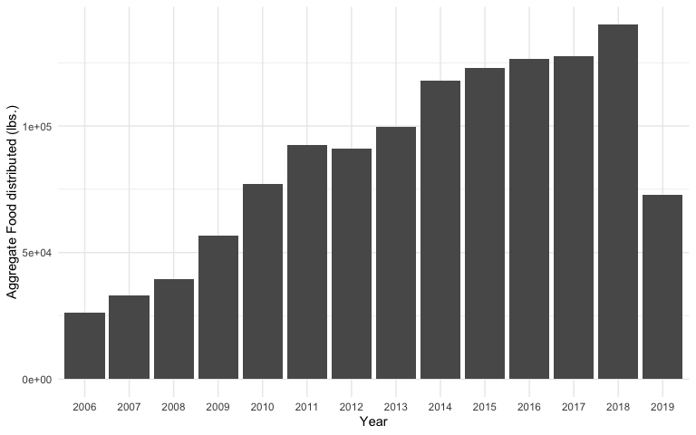

Analysis of Urban Ministries of Durham Data
================
Joseph Foster
9/25/2019

### Motivation of Overview

Given one of the primary methods through which UMD is helping to end
homelessness is food, I aim to assess how well the organization has
distributed food in the past, and what factors may have influenced that
distribution.

### Report

I first looked at how much food is distributed annually from 2006 to
current date. What I found was the total annual food provided has
increased over the last 5 years, and has been trending upward since
2006.

To understand how much food was being distributed per transaction, I
looked at the distribution of food quantity per interaction over a year
for the past 13 years. This showed the average size of each food
distribution has been stable for nearly a
decade.

To understand if paying a bill impacts the amount of food received per
interaction, I looked at the amount of food received per interaction on
an annual basis for individuals who reported paying a bill and those who
did not. Over the past 13 years only two of the years showed a
significant difference in the amount of food received when the client
also reported paying a bill. However, these data shouldn’t be over
interpreted as there were only 127 interactions where a bill was
reported as paid, while there were over 65,000 interactions with no
mention of paying
bills.

In summary, over the past decade UMD has been able to increase the total
amount of food reaching its clients, while also increasing the average
amount of food given per interaction. Although the data for clients
paying bills was sparse, there is some evidence to suggest that
reporting payment of bills doesn’t have an impact on the average amount
of food clients receive at a given interaction. Given, one of the
central tenants of UMD is to provide food to the community these
preliminary results are encouraging.

### Notes on future data collection

1.  While cleaning the data I noticed there were lines dating back to
    1931, which predates the existence of UMD. There are also records
    listing future dates. It would be helpful to understand if these
    data are erroneous or if they have some other type of significance.

2.  While looking into the total amount of food provided each year I
    came across a record (client \#: 12943) that had received 450121
    pounds of food during one interaction. I assume that this was a data
    entry error. It would be helpful to know what the upper and lower
    limits are on the amount of food distributed at any one time.

3.  The analyses reported here focused on the year range 2006-2019
    because the data before 2006 was sparse in comparison. Are there
    additional records from earlier years?
