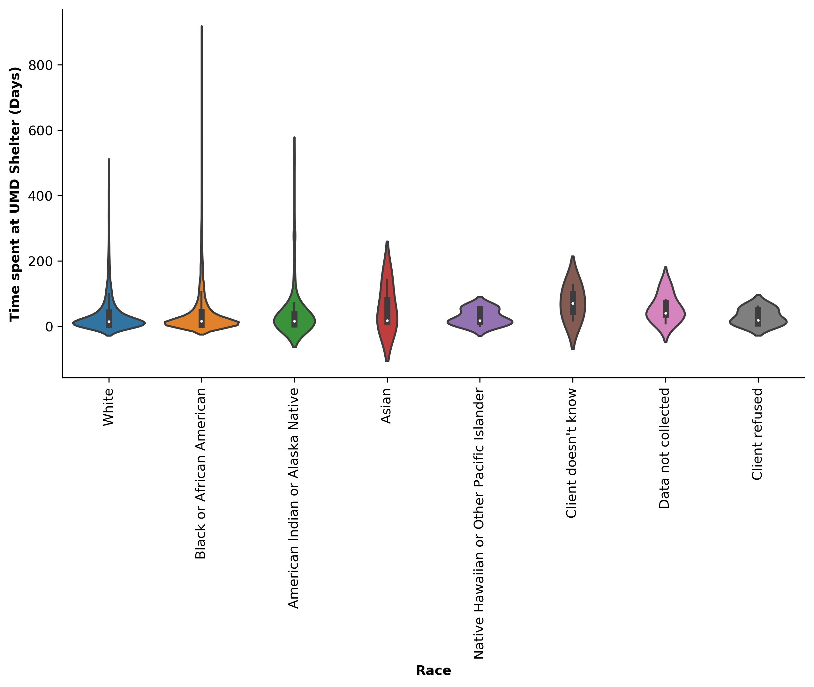
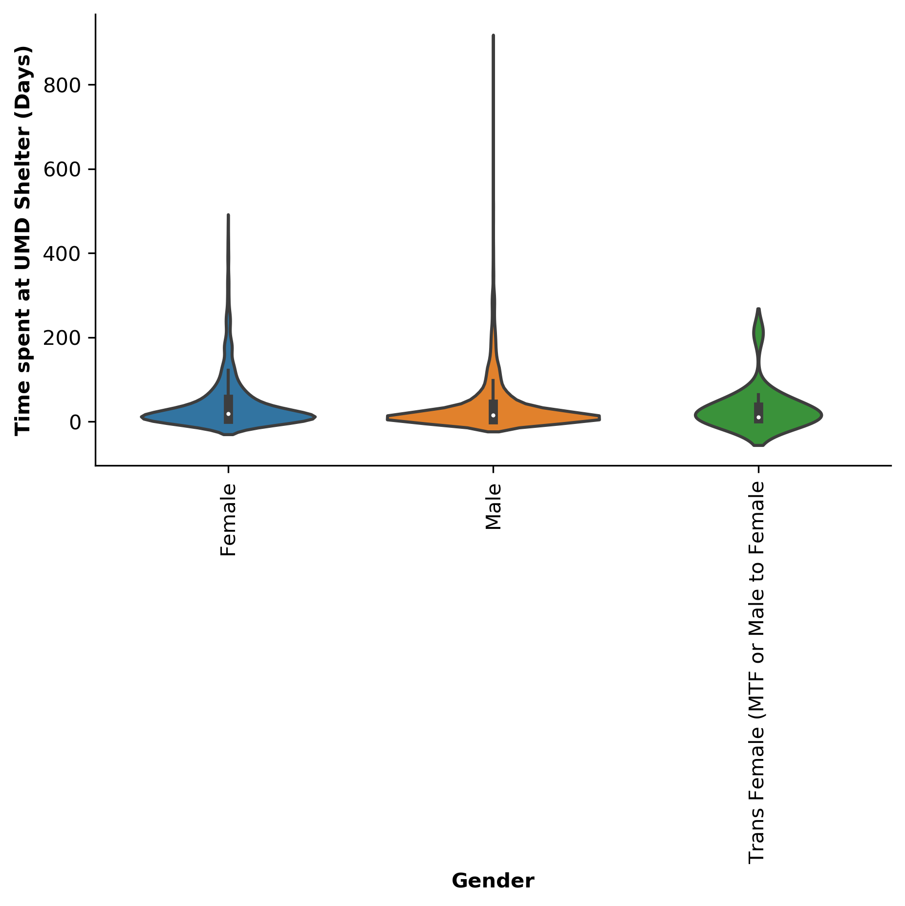
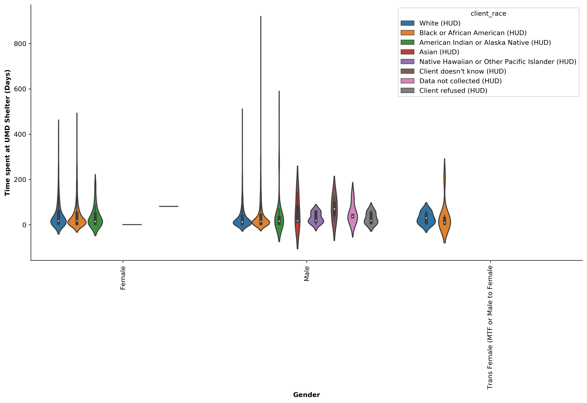
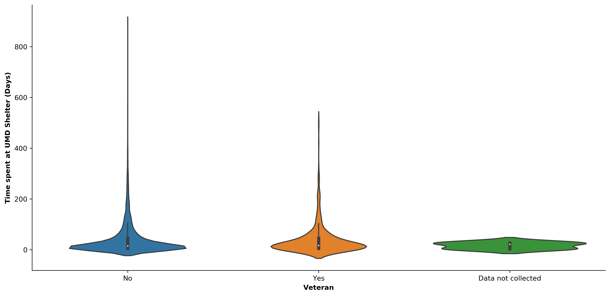
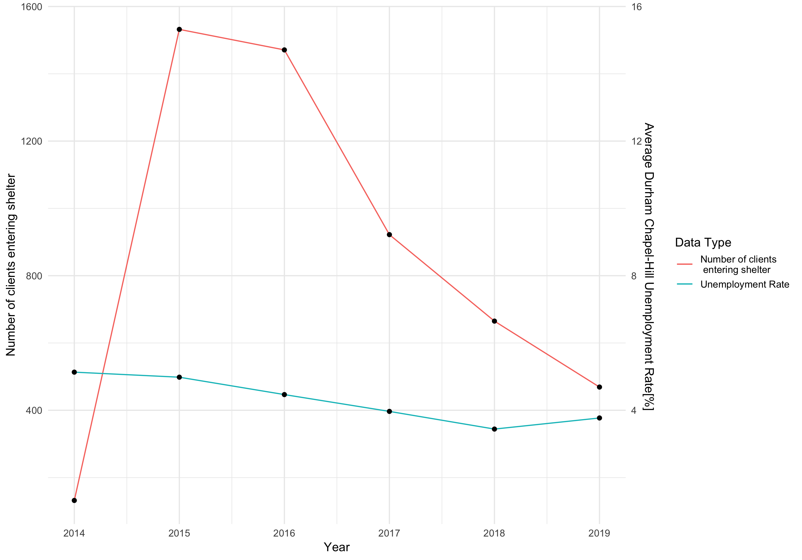

```{r setup, include=FALSE}
knitr::opts_chunk$set(echo = TRUE)
```

### Motivation of Study

Urban Ministries of Durham (UMD) is helping to end homelessness through the distribution of food, providing shelter, and helping develop futures. Here I aim to assess how length of shelter stay relates to different demographic information. Specifically I am looking at how duration of shelter stay associates with race, gender, and veteran status. I will also explore the relationship between local unemployment rate and number of clients staying at the shelter. The hope is to identify different trends that might inform which subgroup of UMD clients might need additional resources or help.

### Report


I first looked at the distribution of shelter visit length for all record races. These data are from the years 2012 to 2019, with the majority of the data from 2014 to 2019. These data show that of the reported race categories the widest distribution length of stay was seen in white, African-american, and native american clients. On average, individuals across all race identities had stays less than 100 days. One of the most striking results of this analysis was the handful of individuals in the African-american population that stayed for several hundred days. These individuals might warrant additional assistance. However, it is worth noting here that verification of the entry and exit dates for all individuals with several hundred day stays is important to make sure these data are not skewed by inaccurate data entry. 




I next looked at how length of stay was distributed across gender. Again, looking at the same records discussed above, I split the data into the three reported categories, male, female, and trans female. These data again show that on average all three groups spend near 30 days at the shelter. However, the men have a much wider range of days in the shelter compared to female and trans female. These data show the majority of clients will spend less than 30 days in the shelter men are have had instances of longer stays, lasting up to several hundred days. This indicates that may be more likely to need resources for a substantially longer period. 


Given men had more instances of longer stays at the shelter, I next subdivided the male group into racial identities. These data show that white, African-american and native-american men have a wider range of days spent at the shelter. However, men who identify as other races or didn't provide the information were far fewer in number, therefore these data should be interpreted with care. Again, the average length of stay was less than 30 days for all groups with the exception of clients who either didn't know their race or they data wasn't collected. 



Finally, I looked at how the duration of how long clients stayed at the shelter relative to their veteran status. The majority of veterans stayed at the shelter for fewer than 30 days. What is interesting is that the range of days spent at the shelter was smaller for veterans as opposed to non-veteran population. Understanding why the is the case might be of interest for future studies.



To understand the relationship between length of stay at the shelter and local unemployment, I looked at the average unemployment rate for Durham and Chapel Hill NC from 2014-2019 relative to the number of clients that entered the shelter for those same years. The average unemployment rate has been declining over the last 5 years with the exception of 2019. During that time the number of clients entering the shelter has also been dropping. However, these data only represent approximately 2300 of the clients being served at UMD. It is important to verify how much of the population this represents before making any conclusions. 



### Conclusion
In summary, these data warrant further study into how length of stay at the shelter relates different demographics. Here I show that the majority of the clients don't stay in the shelter for a long period of time. However, there are a small population of individuals that are staying for longer periods up to hundreds of days. However, given these data look at about 2300 individuals it is important to determine does that number represent a significant portion of the total population being served by UMD. I also show that over the last 5 years the number of people entering the shelter is dropping, and that seems to correlate with a drop in local unemployment. However, further investigation into this relationship is needed prior to making any strong conclusions. 
