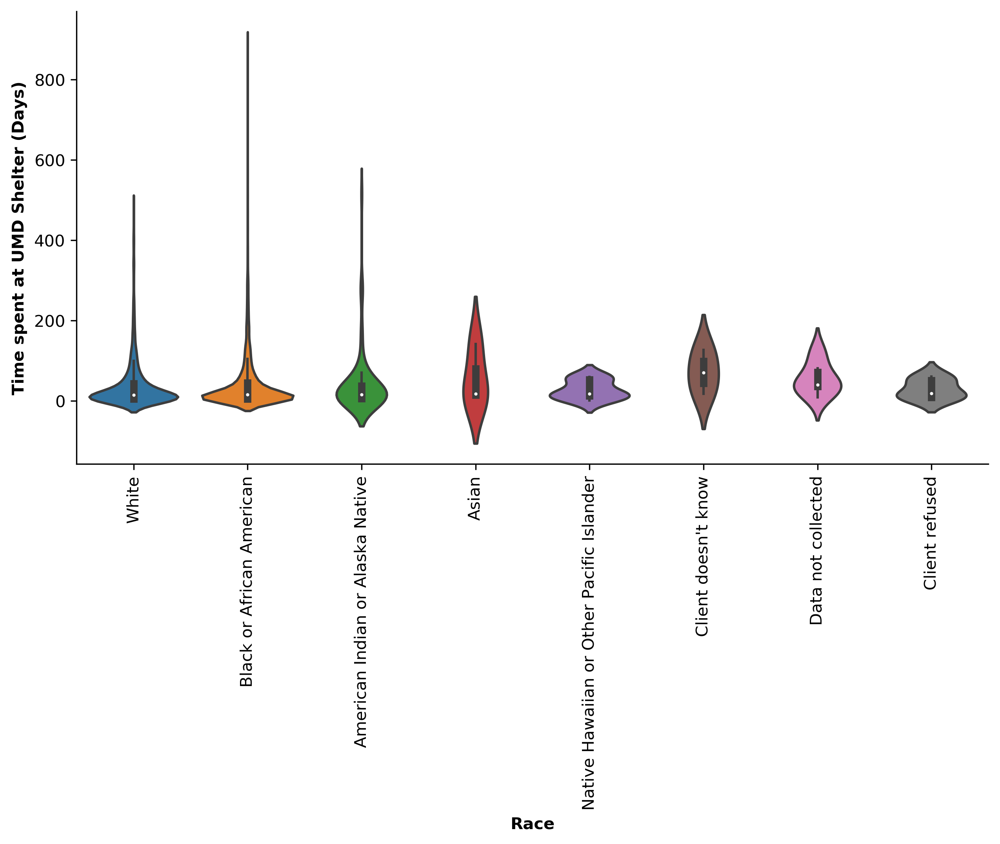

Analysis of Urban Ministries of Durham Shelter Data
================
Joseph Foster
12/02/2019

### Motivation of Study

Urban Ministries of Durham (UMD) is helping to end homelessness through
the distribution of food, providing shelter, and helping develop
futures. Here I aim to assess how length of shelter stay relates to
different demographic information. Specifically I am looking at how
duration of shelter stay associates with race, gender, and veteran
status. I will also explore the relationship between local unemployment
rate and number of clients staying at the shelter. The hope is to
identify different trends that might inform which subgroup of UMD
clients might need additional resources or help.

### Report

I first looked at the distribution of shelter visit length for all
record races. These data are from the years 2012 to 2019, with the
majority of the data from 2014 to 2019. These data show that of the
reported race categories the widest distribution length of stay was seen
in white, African-american, and native american clients. On average,
individuals across all race identities had stays less than 100 days. One
of the most striking results of this analysis was the handful of
individuals in the African-american population that stayed for several
hundred days. These individuals might warrant additional assistance.
However, it is worth noting here that verification of the entry and exit
dates for all individuals with several hundred day stays is important to
make sure these data are not skewed by inaccurate data entry.

I next looked at how length of stay was distributed across gender.
Again, looking at the same records discussed above, I split the data
into the three reported categories, male, female, and trans female.
These data again show that on average all three groups spend near 30
days at the shelter. However, the men have a much wider range of days in
the shelter compared to female and trans female. These data show the
majority of clients will spend less than 30 days in the shelter men are
have had instances of longer stays, lasting up to several hundred days.
This indicates that may be more likely to need resources for a
substantially longer period. 

Given men had more instances of longer stays at the shelter, I next
subdivided the male group into racial identities. These data show that
white, African-american and native-american men have a wider range of
days spent at the shelter. However, men who identify as other races or
didn’t provide the information were far fewer in number, therefore these
data should be interpreted with care. Again, the average length of stay
was less than 30 days for all groups with the exception of clients who
either didn’t know their race or they data wasn’t collected.

Finally, I looked at how the duration of how long clients stayed at the
shelter relative to their veteran status. The majority of veterans
stayed at the shelter for fewer than 30 days. What is interesting is
that the range of days spent at the shelter was smaller for veterans as
opposed to non-veteran population. Understanding why the is the case
might be of interest for future studies.

To understand the relationship between length of stay at the shelter and
local unemployment, I looked at the average unemployment rate for Durham
and Chapel Hill NC from 2014-2019 relative to the number of clients that
entered the shelter for those same years. The average unemployment rate
has been declining over the last 5 years with the exception of 2019.
During that time the number of clients entering the shelter has also
been dropping. However, these data only represent approximately 2300 of
the clients being served at UMD. It is important to verify how much of
the population this represents before making any conclusions.

### Conclusion

In summary, these data warrant further study into how length of stay at
the shelter relates different demographics. Here I show that the
majority of the clients don’t stay in the shelter for a long period of
time. However, there are a small population of individuals that are
staying for longer periods up to hundreds of days. However, given these
data look at about 2300 individuals it is important to determine does
that number represent a significant portion of the total population
being served by UMD. I also show that over the last 5 years the number
of people entering the shelter is dropping, and that seems to correlate
with a drop in local unemployment. However, further investigation into
this relationship is needed prior to making any strong conclusions.
